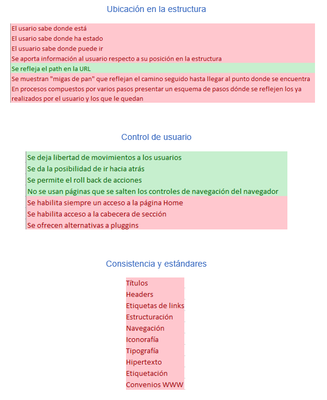
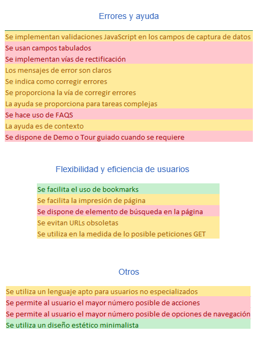
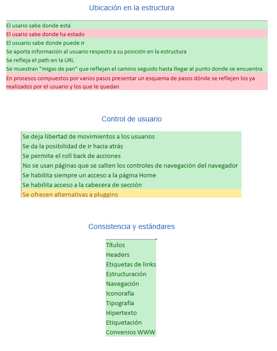
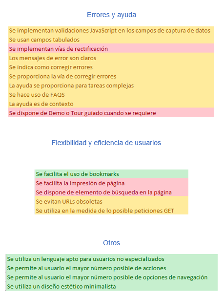
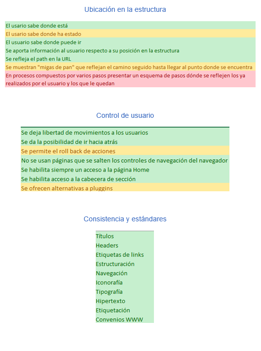
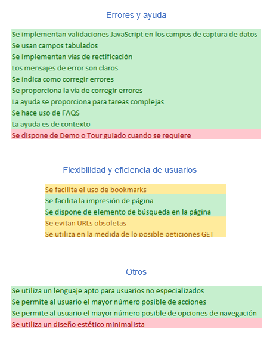

# 1. Análisis página WMAT.

En primera instancia, la página WMAT presenta un diseño arriesgado, en parte atractivo, pero difícilmente entendible. De igual forma, para poder dictaminar su usabilidad, se ha realizado el checklist de Nielsen, en el que ha obtenido las siguientes calificaciones:

Tras realizar dicho checklist de usabilidad, podemos llegar a la conclusión de que la usabilidad en esta página web es mínima. Esto es debido a que, en la página de inicio el usuario se puede perder, al no aclarar nada (ni de que es la página, ni a que se puede acceder,..), de igual forma, no dispone de ayuda para poder entender el formato de la página web. Desde mi punto de vista, es un claro ejemplo de que el diseño minimalista no siempre es la mejor opción.

# 2. Análisis página MadeByTemple.

En primera instancia, podemos observar que dispone de una estructura clásica, con navegador que facilita el acceso dentro de la web. De igual manera, podemos darnos cuenta de que dispone poca decoración, cada elemento está por algún motivo, con esto podemos pensar que se ha diseñado bajo la idea de una página minimalista. A su vez, para poder dictaminar si esta web dispone de una buena usabilidad he seguido el test de Nielsen, cuyos resultados han sido:

Tras realiza dicho análisis podemos afirmar que la usabilidad en este sitio web es muy buena, debido a que, dispone de todas las características necesarias para tal fin. De igual manera no todo es perfecto, dispone de cosas a mejorar como implantar un pequeño tutorial orientativo (aunque la página sea muy intuitiva).

# 3. Análisis página StaffCreativa.

En primera instancia, podemos afirmar que esta página no se ha diseñado bajo la filosofía minimalista. No obstante, dispone de un diseño (aunque cargado), bastante atractivo e intuitivo lleno de ayudas para el usuario. Para poder dictaminar su usabilidad se ha realizado el test de Nielsen cuyo resultado ha sido:

Tras realizar el análisis, podemos concluir (pese que dispone un diseño no minimalista), que la página web despone de una usabilidad bastante buena. De igual manera, bajo mi punto de vista, esta plataforma es un claro ejemplo de que (aunque no es recomendable) un diseño no minimalista puede ser muy bueno (siempre que sea bien llevado como es el caso).

# 4. Conclusión.

Tras realizar los análisis pertinentes, podemos ver tres ejemplos claramente definidos: A) un diseño minimalista que no funciona; B) uno que sí y c) un diseño no minimalista que funciona. Con lo visto, podemos decir que no siempre hay que hacer un diseño minimalista (depende del tipo de la aplicación que se requiera hacer y de las habilidades del programador). De igual manera, en cualquier aplicación hay que seguir las recomendaciones de usabilidad y, realizar test con personas para poder alcanzar una aplicación lo más intuitiva posible.
